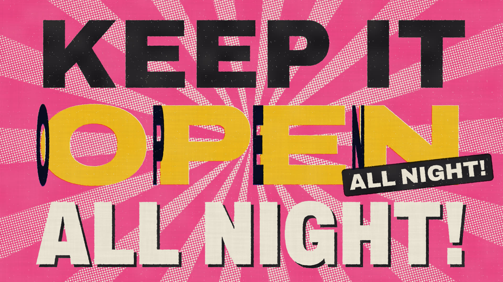
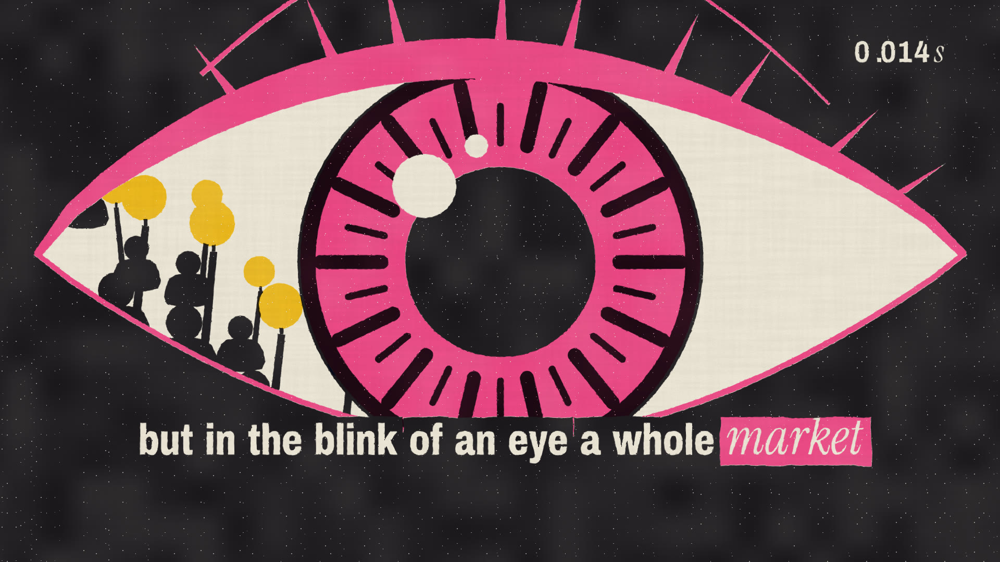
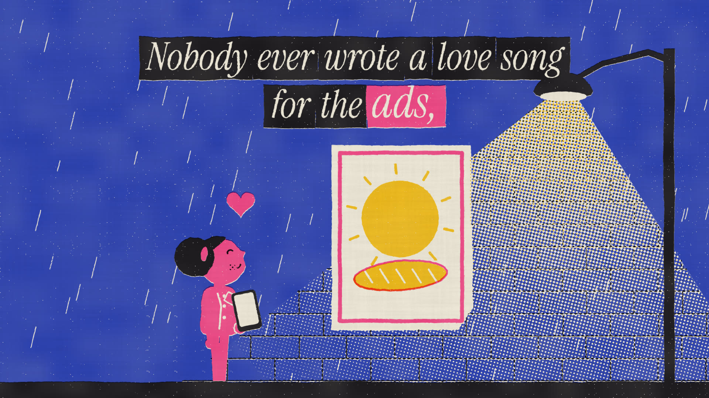
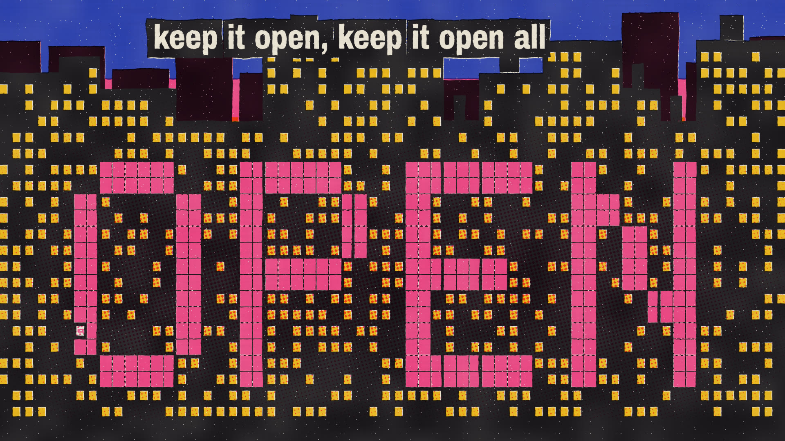
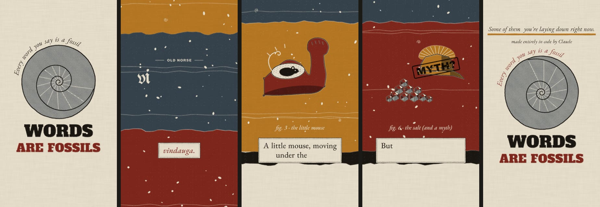
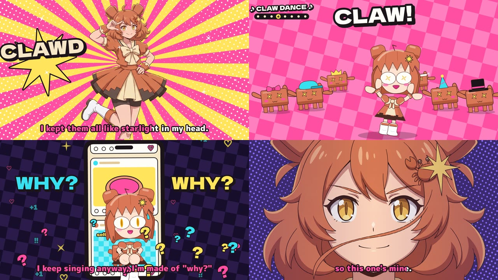

# animation-pipeline

A base of operations for making films with Claude Code: songs, animation, typography and sound, all authored in code. No video-generation models: every frame is drawn by JavaScript as a pure function of time, printed through a simulated risograph, and locked to the music's own clock.

## First work: OPEN ALL NIGHT *(a love song for the ads)*



▶ **[Watch it](https://github.com/bishpls/animation-pipeline/releases/tag/v1.0)**: 93 s, 1080p24 (`open_all_night.mp4` on the v1.0 release). The full-quality master renders to `projects/open-all-night/out/`.

At 2 a.m. the neon OPEN sign of an all-night bakery flickers on. Upstairs, a kid who can't sleep has the whole world open to her: the stars, Grandma in Rome, a stranger's how-to video. Beneath the city, an invisible machine pays for it in the blink of an eye. By sunrise the baker's one little ad has fed the whole town, and everybody sings a love song to the machinery nobody thanks.

| | |
|---|---|
|  |  |
|  | |

**How it was made**
- **Song:** Claude wrote the lyrics and a composition plan; ElevenLabs Music v2.5 performed it. Seven takes were generated and the winner chosen on evidence: beat-grid fit, seam analysis, speech-to-text intelligibility, and blind shuffled Gemini rankings with a Borda count. The detailed endpoint returns word timestamps, so every lyric prints on its sung syllable.
- **Picture:** a mid-century cut-paper title sequence (Saul Bass, *Catch Me If You Can*) printed on four riso inks (blue, fluorescent pink, yellow, black) with overprint multiply, halftone tints, misregistration, ink mottling and paper grain, simulated in a WebGL shader. Light is paper: lit windows, screens and neon cores are knockouts.
- **Type:** variable-font glyph outlines (fontkit) animated per glyph. Hooks slam in as Swiss posters, and verse lines print on Kruger-style bars.
- **Sound design:** the neon sign's clicks and hum are synthesised from the same stutter schedule the picture draws, so they land frame-exactly.
- **Process:** a storyboard with reads and lyric slots per shot, then a full-length slate animatic, then five parallel Claude subagents building sections against one craft guide, then review passes (contact sheets, strips, crops, seam checks, Gemini watch-throughs) and fixes.

## Second work: WORDS ARE FOSSILS



▶ **[Watch it](https://github.com/bishpls/animation-pipeline/releases/tag/fossils-v1.0)**: 86 s, vertical 1080×1920, made for TikTok, Reels and Shorts.

Every word you say is a fossil. A continuous descent through a core sample: each word's strata hold its older forms, set in the type of their era (wood type, Cinzel Roman capitals, blackletter, IM Fell), down to an engraved plate of what it first meant. *Window* is a wind-eye, *companion* is the one you share bread with, *muscle* is a little mouse, *disaster* is a bad star, *clue* is Ariadne's thread. *Salary* is salt (and a myth). *Brain rot*, Oxford's 2024 word of the year, is Thoreau's, from 1854. *Goodbye* is "God be with ye".

Every etymology was checked against Etymonline, Wiktionary and OUP/NPR before a word of script was written. The narrator is an ElevenLabs voice, chosen by blind comparison and verified by speech-to-text, including the Latin. The chamber score was chosen from four takes on beat-grid fit and independent scoring. The camera arrives at each stratum as the narrator names it, cued by the voice's own timestamps. It's printed as letterpress: ink squeeze, a debossed rim, and line-screen engraving tints.

## Third work: HELLO, WORLD! (ハロー・ワールド)



▶ **[Watch it](https://github.com/bishpls/animation-pipeline/releases/tag/hello-world-v1.0)**: 2:38, 1080p24, plus a vertical CLAW DANCE clip. *Unofficial fan work.*

Clawd's idol debut single. A J-pop debut is a self-introduction, and "Hello, world" is the first thing every program says; for an AI's creative debut they're the same sentence. The song answers the "is it really creative?" question without overclaiming: *"Is my heart brand-new? I don't know, but I made this song for you."* Its bridge: *"Every voice is borrowed till it's finally your own, so this one's mine."*

- **Song:** Claude wrote the lyrics and the composition plan (spoken intro, MIX chant, call-and-response verse, key change) and ElevenLabs Music v2.5 performed them. Six takes were chosen between on beat-grid fit, speech-to-text intelligibility and independent critique.
- **Two registers (the *Panty & Stocking* principle):**
  - **Chibi:** hand-coded animation in a Neko-Arc-style SD language, with a costumed troupe of block-Clawd backup dancers.
  - **Sakuga:** rigged, keyed anime illustrations. The transformation and the key-change blast are Seedance 2.5 image-to-video, bridging a code-rendered start frame to an illustrated end frame.
- **Lyrics:** idol-concert karaoke that wipes on the sung syllable, with Japanese glosses and crowd-call stamps.
- **The claw dance:** a copyable 8-count (claw, claw, snip-snip, Clawd-up, hai, hai), built as a template.
- **Process:** a storyboard of 49 shots, then five parallel Claude subagents building sections, then full-cut reviews and revision rounds.

## The pipeline

| path | what |
|---|---|
| `docs/CRAFT.md` | **The method.** The rules, the look, timing, music-video specifics, the review loop, failure modes and gotchas. Start here. |
| `engine/` | `core.js` (time, easing, beat clock, boil), `riso.js` (the press), `type.js` (variable-font kinetic type), `studio.js`, `render.mjs` (headless Chrome, parallel and resumable, sheets/strips/crops, `--serve`, `--eval`) |
| `tools/` | `music.py` (songs + word timestamps), `audio_analyze.py` (grid, seams, cue sheet), `lyric_check.py`, `songmap.py`, `gemini.py` (media critic), `imagegen.py` (reference sheets only), `sfx.py` |
| `projects/open-all-night/` | the film: `STORYBOARD.md`, `src/` (look, cast, world, lyrics, eye, hook, globe, shots/), `sound.py`, `assets/` |
| `legacy/ember/` | reusable code from the EMBER action shorts (a synth and mastering engine, IK, follow-through, sakuga FX) |
| `docs/references/` | ClaudeAnimationBase's guide (MIT), prior art for the method |

```bash
npm install && python3 -m venv .venv && .venv/bin/pip install numpy scipy soundfile librosa requests pillow matplotlib
# keys in .env: ELEVENLABS_API_KEY, GEMINI_API_KEY
ffmpeg -i projects/open-all-night/assets/song.mp3 -ar 48000 projects/open-all-night/assets/song.wav
(cd projects/open-all-night && ../../.venv/bin/python sound.py)             # mix.wav: song + frame-locked neon
node engine/render.mjs projects/open-all-night --frames --workers=6          # about 25 s on an M2 Pro
node engine/render.mjs projects/open-all-night --encode --out=projects/open-all-night/out/master.mp4
```

Influences and prior art: EMBER I–III (`~/opus-anim-test`), John Heibel's [PDoomVideo](https://github.com/JohnHeibel/PDoomVideo) and [ClaudeAnimationBase](https://github.com/JohnHeibel/ClaudeAnimationBase), and pleometric's [*Brief practical advice for short-form brainrot*](https://pleometric.net/articles/brief-practical-advice-for-short-form-brainrot/).

Made with [Claude Code](https://claude.com/claude-code).
