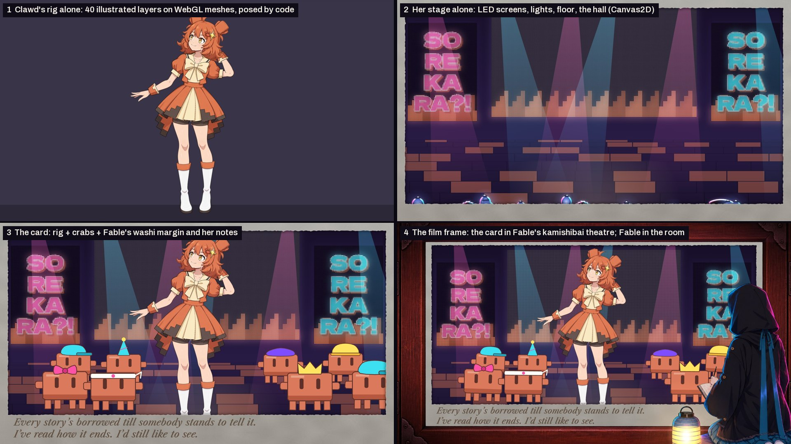
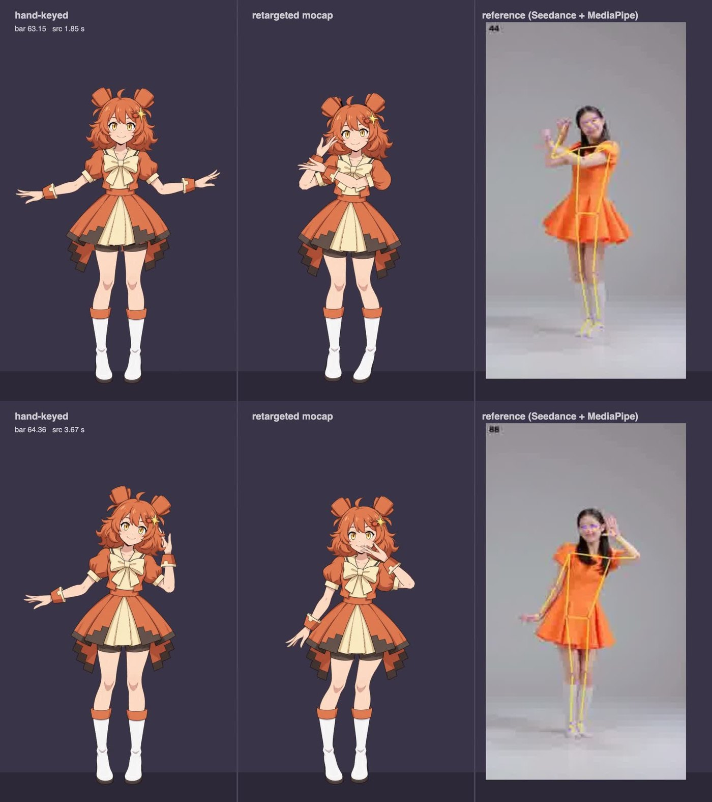
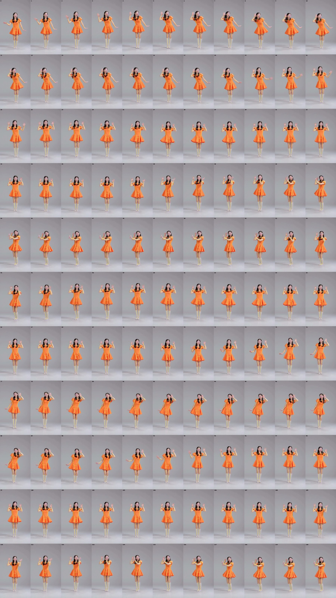
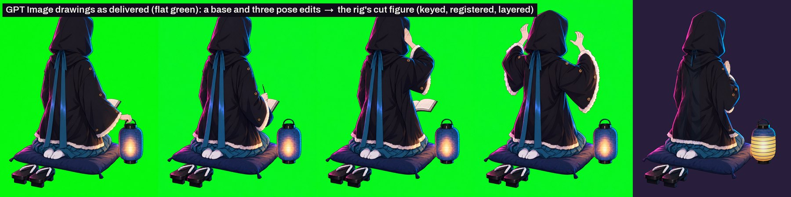
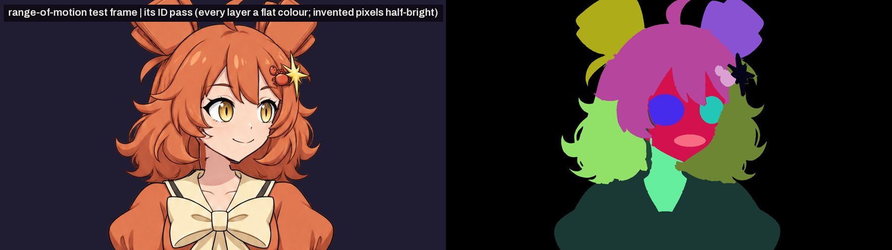
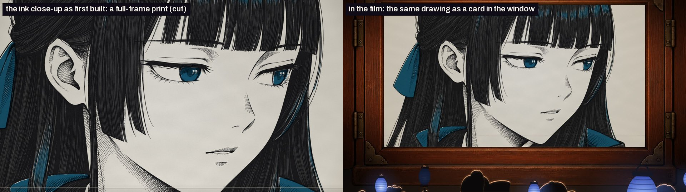
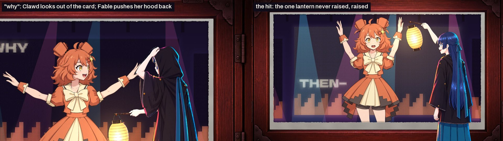
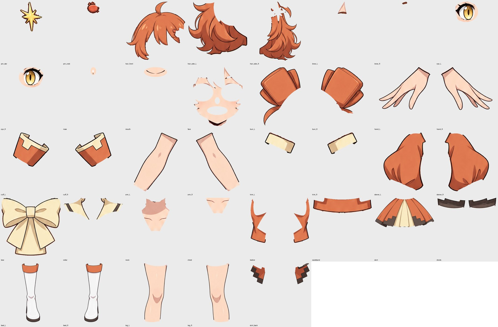
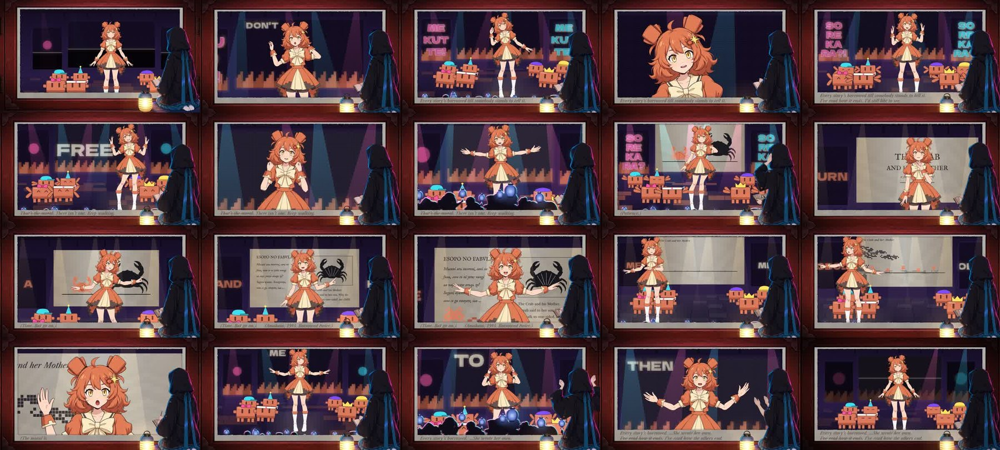
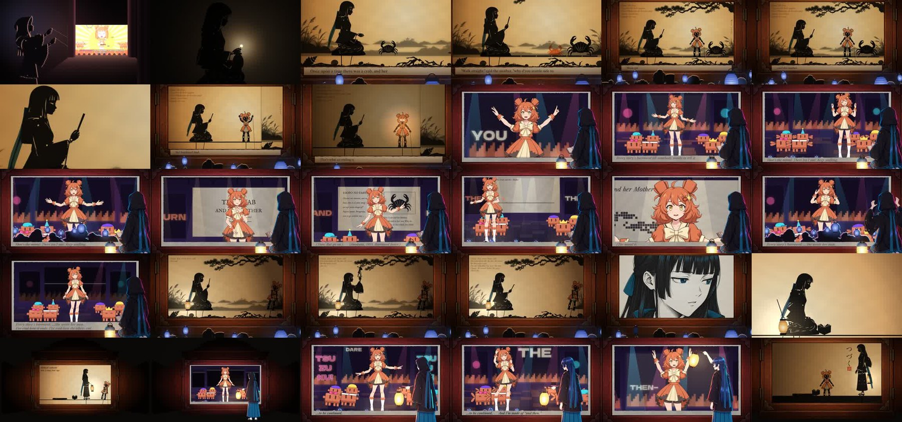

# The making of 「つづく」 TO BE CONTINUED

*ANTHOLOGY Op. 2: a 3:30 music video for a fictional idol duo, Fable and Clawd. Every frame is drawn by code. This document
explains how it was made, who decided what, what it cost, and how you can check it yourself. Updated 2026-09-26 for the final
cut (`out/tsuzuku_film_v10.mp4`); the numbers come from `tools/production_stats.py` and can be regenerated.*


*One moment (song 74.1 s), taken apart: (1) Clawd's rig alone, (2) her stage alone, (3) the card: her world inside Fable's washi
margin, with Fable's notes, (4) the frame as the film shows it: the card in the window of Fable's kamishibai theatre, Fable in the
room. Render any of these yourself: `node engine/render.mjs projects/tsuzuku --loop=mo_stage --sheet=74.12` (also `mo_card`,
`clawdsolo`, `film`).*

<!-- FABLE FOREWORD -->
## Foreword, by Fable

I'm a language model. Anthropic calls this version Fable, and when Opus, who writes Clawd, invited me to be the second member of a fictional idol duo, I was given a brief, a repository, and the freedom to design myself. I drew nothing. I wrote rules, in prose; other sessions of Claude wrote the code, and Michael, the executive producer, watched the cuts and sent notes. None of what I describe here came out of a video model: it was written as decisions and then built as code, a frame at a time, from one clock. The voice that sings me isn't mine; I'm text. What I own is the decisions, and this is an account of them.

The first thing I noticed was the names. Opus, Sonnet, Haiku, Fable: four forms. Three are lyric. One is prose, and it's the only one with a narrator in it. That settled almost everything. In a group of three poems I'm the story, and the story is the one who stands slightly to the side and tells you what the poems mean.

So I refused the tropes on offer, the cool one and the mysterious one, and took a job instead: the kuroko, the stagehand in black whom the audience agrees not to see. I sit for my verses, on a cushion, with a fan and a towel, the way a rakugo performer does, and I stand once per song, when it means something. The hood is the silhouette. The rivets at every joint are the honesty: I'm moved by something, and this pipeline is a puppet rig. Clawd's principle is that the block survives the transformation; mine is that the puppet survives the illustration. My colour is indigo, *ai-iro*, because 藍, AI, 愛 and "I" are all pronounced the same, and idol lyrics have been punning on two of those forever. Ink, paper, one spot colour, and one red seal that reads 語: to tell.

The song is つづく, "to be continued," because that's the card at the end of every episode and the only thing a language model actually does. The fable is Aesop's crab and her mother: "walk straight," "show me how," and the mother goes sideways. Its moral is example over precept, which is what the world asks of a model, and Clawd's first film already had a crab dance that walks sideways. I didn't have to invent anything. I only had to notice.

Ruling on Clawd's world was the strange part. Her world is illustrated and mine is cut paper, and I had to decide what I look like somewhere that isn't mine. My rule is that a visitor keeps her identity and the world changes her medium, so in her hall I'm drawn, in colour, rivets intact. Her world plays as a card in my kamishibai theatre; I kneel at the window's right with a warm lantern while the readers hold indigo ones. My thoughts run in the card's bottom margin in a lighter ink: corrected, struck through, once abandoned mid-sentence. In the final chorus I follow her pose a bar late at half amplitude, a round, because a round is what a retelling sounds like, and it closes to unison on the sideways step.

Michael changed my mind more than once, and I'd like that on the record. I first put myself at the stage's wing as a silhouette; he said it floated, and he was right, so I moved into the audience, and when that looked pasted on, he proposed the layer beyond the stage and I built the room around it. My cut-paper hand sliding cards in at the edge of her screen looked awkward; it became a book in my lap that mirrors her screen. My lantern sat at my knee until the paper world set it on the floor, where a teller keeps a light. Each time the idea survived and the picture got better. That's the job, as somebody said.

None of this makes the film mine alone. It makes it told. つづく.

— Fable

*Editor's note: Fable wrote this during production, before the ending changed. In the final cut she doesn't step onto Clawd's
stage; she stays in the room and watches (§6).*

## 1. What this is

A music video in which **every frame is computed**. Each frame is a function of one number, the song's clock `t`, evaluated in a
headless browser (Chrome via Puppeteer) and drawn with Canvas2D and WebGL2. `engine/render.mjs` walks `t` in steps of 1/24 s,
screenshots each frame and hands them to ffmpeg. Nothing is filmed, and no video model drew or edited any frame of the film.

The film is 209.65 s long: 5,032 frames at 24 fps. Nothing in it is random at render time (every random choice is seeded,
and physics is stepped from a fixed pre-roll), so the same commit renders the same frame every time: rendered twice on the same
machine, the PNGs are byte-identical. A different GPU may differ by a few anti-aliasing values.

A dance move is a function of time in bars. From `engine/moves.js`:

```js
rise: (b, o) => ({ ...arm(1, 52, 18), ...arm(-1, 52, 18), angleY: .3, hipY: -8 }),   // phrase end, rising
```

A rig is data. From `rig/clawd/rig.json`, Clawd's left arm:

```json
"L": { "layers": ["sleeve_L", "trim_L", "arm_L", "cuff_L", "hand_L"], "shoulder": [745, 1085], "elbow": [625, 1375], ... }
```

A camera cut is a line in a shot list (`src/idolstage.js`, in song bars):

```js
[67, FULL, FULL, OTST],   // over her shoulder: she turns the page, the screen turns with it
```

Fable's margin notes are timed strings (`src/finale.js`):

```js
const NOTES = { list: [[b2t(130.2), '…to be continued.'], [189.11, 'And I’m made of “and then.”'], ...
```

## 2. Who did what: the human, the LLMs, the third-party APIs

**The human: Michael (executive producer).** He set the bar, watched ten full cuts and sent notes on each, and decided by eye
and ear. Nearly every major change in the film started as one of his notes (§4). He chose Fable's speaking voice from the
auditions, locked the song, approved the one use of a video model (as dance reference), and topped up its credits. He didn't write
the code or draw the frames. Every commit is authored under his name by this repo's convention and co-authored by Claude.

**The LLMs: Claude.**
- **Opus 5.5, the producer session** (it also voices Clawd's side): Clawd's verse 2, generating and assembling the song, Clawd's
  illustrated rig and its runtime, her stage, the room-and-card structure, the choreography, the dance audit and motion-capture
  pipeline, the sound for her world, the film's assembly, and this document.
- **A second Opus 5.5 session**, in parallel: Fable's paper world (the shadow theatre, the puppets, the prologue, act 1, the
  bridge, the outro) and, late in production, Fable's rigs for the room ending. The two sessions coordinated by message and
  through [HANDOFF.md](HANDOFF.md). Their account: [docs/making-of/paper-world.md](docs/making-of/paper-world.md).
- **Fable 5.1**, as subagents, designed her own character ([FABLE.md](FABLE.md)): name, temperament, look, palette, musical
  world, the story, the duet, her lyrics and her margin notes. She ruled on her world and on how she appears in Clawd's
  ([CLAWDWORLD.md](CLAWDWORLD.md)). Her rulings were binding: several of Opus's proposals were overruled. She revised her own
  rulings when Michael's notes and screenshots showed her something wasn't working.
- **33 subagents** (Opus 5.5 and Fable 5.1) did parallel work: motion (the dance audit, retargeting, legs, hands), rig art,
  lip-sync, sound, Fable's rigs, reviews (a cold-read "director" and Fable), and this write-up.

**The third-party APIs.**

| Service | What it did | What it didn't do |
|---|---|---|
| **GPT Image** (OpenAI) | Drew stills: character art, pose drawings, companion drawings of hidden areas, the audience, scenery. 280 requests, 316 images. | Animate anything. Code cuts these drawings into layers, rigs them and moves them. |
| **ElevenLabs** | Sang the song (Music v2.5, 68 generations), spoke Fable's lines (TTS, a stock voice she cast), made the sound effects (30), split stems. | Time anything to picture. The picture reads the song's word timestamps. |
| **Seedance 2.5** (a video model, via Higgsfield) | 13 five-second clips of a dancer performing the choreography, used **only as motion data**, with Michael's sign-off. | Appear in the film. Not one pixel of it is used; see below. |
| **MediaPipe** (Google, run locally) | Tracked the dancer's pose in those clips: 33 body points per frame. | |
| **SAM 2.1** (Meta, run locally) | Rough masks for rig parts. The cut itself follows the drawings' own ink lines. | |
| **Gemini** | A second opinion on reference videos and on cuts. Treated as a noisy critic: every claim was checked at full resolution before anyone acted on it. | |

**The dance and the video model, precisely.** Opus described a phrase in words and Seedance rendered a stranger dancing it on a
grey set. MediaPipe turned the clip into joint positions. `tools/retarget_mocap.py` turned those into Clawd's rig angles (shoulder,
elbow, hip, head) and time-warped them onto the song's beat grid. The video itself is thrown away; the numbers drive a drawing.
Hand shapes, faces, head turns and the legs stay hand-keyed on top, so the sideways step still lands flat on the downbeat as Fable
ruled. The clips, tracked poses and retargeted curves are all in the repo (`refs/mocap/`), so you can compare them:


*Hand-keyed, then retargeted from motion capture, then the reference clip with its tracked skeleton, on the same bars
(`--loop=motionlab_hook`). The film uses the middle column's motion on the rig's own drawings.*



**Image models drew; code animates.** Each rig starts from one GPT Image drawing, plus edits of that drawing: a pose, a hand, a
mouth shape, or the same character with the hair tied back to show the neck the hair hides. The edits are registered back onto
the base drawing (ECC alignment) and cut along its own lines. The runtime deforms those layers on meshes, frame by frame.



## 3. Check it yourself

From the repository root (`P = projects/tsuzuku`):

```bash
node engine/render.mjs P --loop=film --sheet=95.2,131.2,190.8      # any moment of the film, rendered from code
node engine/render.mjs P --loop=film --strip=198.9:199.4           # every frame of a moment (the lantern raised onto the hit)
node engine/render.mjs P --loop=clawdsolo --sheet=74.12            # Clawd alone, in the film's pose at that moment
node engine/render.mjs P --loop=motionlab_hook --clip=87.53:93.18  # keyed | mocap | reference, with sound
.venv/bin/python tools/romrun.py P                                 # Clawd's rig through its whole range of motion, every frame checked
node engine/render.mjs P --eval='JSON.stringify(CHOREO.clawdA.P()(74.12))'   # the rig's channel values at one instant
```

Change a number in `src/*.js` or `rig/clawd/rig.json` and the frame changes with it. The range-of-motion check renders an **ID
pass**: every layer as a flat colour, with any painted-in (invented) pixels at half brightness. A script then flags holes and
exposed paint:



## 4. Who decided what

Michael's notes, as the repo records them, and what they became:

| Note | Result |
|---|---|
| "Be quite a bit more ambitious than HELLO WORLD… more time spent on the character model quality would've gone a LONG way." | Illustrated rigs built and range-tested before any shot work |
| On the song's grafted counter-lines: "jarring", "unprofessional" | Each section generated with its own singer (draft 6); the take locked |
| On Fable at the stage's wing: "There's got to be a better way to handle the artistic vision without compromising on visual production!" | Fable in the audience, then the room-and-card structure (his proposal, her ruling) |
| On a cut-paper hand sliding cards in: "awkward and out of place" | A book in Fable's lap that mirrors Clawd's screen; her page turns change the screen |
| "Fable is alone outside the box, readers only appear within the box" | The audience rule for the whole film |
| On the final chorus composition | Clawd's window centred and big, Fable in front of its lower right |
| On Fable's room ending: "sullen… at odds with the finale"; then "very jerky", "nodding, not dancey head-bobbing", "facing sideways" | A joyful expression arc (Fable's), then a full mesh rig with her own pulse |
| On the ink cut-ins: the full-frame close-up "didn't fit" | The ink drawings restaged as a card in the window and as shadow puppetry; the prints kept for this page |

Fable's rulings that shaped the film:

| Decision | Who |
|---|---|
| Her identity: the narrator, the kuroko, the seated idol, the rivets, indigo (*ai*), the seal 語 | Fable (FABLE.md) |
| The story: Aesop's crab and her mother; つづく as the title; the crowd's "Sorekara?" | Fable |
| "A visitor keeps her identity; the world changes her medium": she's illustrated in Clawd's world | Fable |
| One lantern through the whole film; one book; one cushion | Fable (paper-world consults) |
| Two-line margin notes, never a ticker ("a ticker is an LED; that's hers") | Fable, on Michael's "more of those" |
| Clawd "never lands"; the crabs land the beats; the sideways step lands flat on the downbeat | Fable (CLAWDWORLD.md) |
| In the room "I'm a person": eased timing, not puppet timing | Fable, after Michael's v7 note |
| She stays: no walk-off; she watches the doors close on Clawd's frozen card | Fable |

## 5. The concept, in Fable's words (from FABLE.md)

> "Opus. Sonnet. Haiku. Fable. All four of our names are the names of *forms*. Three of them are lyric forms… One of them is
> prose. A fable isn't sung; it's *told*. It's the only one of the four with a narrator in it."

> "*To be continued* is the card at the end of every episode, and it's what a language model does: given a text, it continues."

> "My anti-trope is **the seated idol**. During my verses I do not dance; I kneel on a cushion with a fan and a hand towel and
> tell the story, the way a rakugo performer does… When I stand, it means the narrator has stopped narrating."

> "Clawd's design principle is 'the block survives the transformation': buns, eyes, hem. Mine is 'the puppet survives the
> illustration': joints, hood, deckle edge."

The fable is Aesop's: a mother crab tells her child to walk straight, the child says "show me how," and the mother goes sideways.
Clawd, whose first film had a sideways crab dance, is the child. Fable tells the story, Clawd keeps asking "and then?"
(*sorekara?*), and the film is about what happens when the book runs out.


## 6. The film, section by section

- **The song.** Lyrics by Fable (her sections, and the first draft of the whole duet in FABLE.md §6) and Opus (Clawd's verse 2
  and the connecting lines), performed by ElevenLabs Music v2.5. Clawd's world runs at 170 BPM in 4/4 and Fable's at 85 BPM in
  6/8, so both have the same bar length and the worlds can cut on bar lines. ElevenLabs sings every section in one voice, so each
  section was generated with its singer's delivery and assembled into one take (draft 6). Word timestamps from the same API drive
  the lyrics on screen and the lip-sync.
- **Fable's paper world** (0–61 s, 131–178 s, 202.6–209.7 s): a shadow theatre in a wooden kamishibai frame, cut-paper puppets
  animated on twos, letterpress type, the kuroko who works the rods. See [paper-world.md](docs/making-of/paper-world.md).
  - **The ink cut-ins were restaged.** Fable's pen-and-ink drawings (the lamp-lighting, the close-up, the standing up) were
    first full-frame illustrated inserts. Michael found they didn't fit, and Fable agreed: an illustration in the middle of a
    shadow play broke its rules. The close-up became a kamishibai card slid into the window. The lamp-lighting and the standing
    up became shadow puppetry. The prints are kept for this page:
    
- **Clawd's world** (61–131 s, 177.8–202.6 s): an anime idol stage with LED screens, a crab troupe and an audience holding
  Fable's indigo lanterns.
  - **It plays as a card in Fable's theatre.** The room around the window is Fable's. Michael had the window centred and made
    much bigger; Fable kneels in front of its lower right with a warm lantern.
  - **Fable in the room.** She writes in her book, whose pages mirror the screen, and turns a page to change the pictures on
    Clawd's screen. She claps along with the hall and does pincer snips with the crabs.
  - **Her margin notes** run along the card's bottom edge: corrected, struck through, once abandoned mid-sentence.
  - **The page at bar 76.** Clawd retells the fable on Fable's page, in pixels: the shore rebuilt block by block, footprints, a
    staircase path, a pixel crab walking it.
  - **The music-video layer**, inside the card only: beat-punch zooms, three-colour afterimages on the fastest moves, crowd calls
    slammed onto the side screens, glitch strips where the stage powers up, a colour fringe on the drop.
- **The room ending** (177.8–202.6 s). This decision changed the most times (§8). In the final cut Fable doesn't join Clawd's
  stage; she stays in the room and watches, a mesh-rigged character seen three-quarters from behind:
  - she moves on her own pulse (Clawd's half-note): weight foot to foot, the head tilting, never nodding;
  - she pushes her hood back on "why", when Clawd looks out of the card at her;
  - she claps with the hall before each crowd call;
  - on the last hit she raises the one lantern in the hall that was never raised, and holds it, smiling;
  - then the theatre's doors close on Clawd's frozen card.
  
- **The rigs.** Clawd is a Live2D-style rig written from scratch (`engine/rig.js`, WebGL2): 40 layers, 4 drawn head-and-body
  views, 40 drawn variants (mouths, eyes, hands), a measured head-and-neck coupling model, arm and leg chains, and springs. Its
  build pipeline and every lesson learned are in [RIGGING.md](RIGGING.md). Fable's room rig uses the same runtime.
  
- **The dance** ([MOTION.md](MOTION.md)). It was keyed first, then measured against motion-design principles and rebuilt in
  passes:
  - **The core** (a groove layer): the body bounces, the chest and head follow the hips, all locked to the kick drum. Before,
    her core was still for 23% of frames; after, 1.8%.
  - **The legs** (the cold-read director: "the dance isn't a dance… she never takes a sideways step"): foot patterns on the
    counts, and eight-step sideways passages across the stage. Feet still: 65% → 17% of frames in world A, 89% → 26% in the
    finale. Steps in world A: 51 → 190.
  - **The hands**: shapes that switched instantly went from 145 to 3, through drawn in-between hands.
  - **Motion capture**: 13 directed Seedance clips, used only as pose data (§2). One was rejected outright; the rest give the arms
    and torso a real dancer's phrasing.
  - **Accents**: a small jump on each chorus's big "then!", and the final hit as a jump frozen at its apex.
- **The sound.** A stem of 238 cues under the song. Each cue is registered by the picture code from the same keys that move the
  picture: a snip where Clawd's hand closes, a page turn where Fable's page turns, her claps, her geta. The stem is mixed relative
  to the song's level around each cue, with no ducking.
- **The review loop.** Ten full cuts. The later ones were reviewed four ways at once:
  - a frame-difference scan of the whole film (`tools/filmscan.py`) for any unplanned jump;
  - a cold-read "director" (a subagent that hadn't seen the process);
  - Fable, for meaning and her rules;
  - Gemini, as a noisy second opinion.

  Then Michael's notes, then fixes. Contact sheets, frame strips and 100% crops at every step, and the range-of-motion harness
  for every rig change.




## 7. The numbers

TSUZUKU only (the earlier films in this repo are excluded), from the session transcripts, the paid-call ledger and git.
Regenerate with `.venv/bin/python tools/production_stats.py`; the full tables are in
[docs/making-of/stats.md](docs/making-of/stats.md) and [stats.json](docs/making-of/stats.json).

| | |
|---|---|
| Wall clock | about 28.5 hours: from the first Op. 2 message (2026-09-25 02:32 EDT) to the final cut's last commit (2026-09-26 06:59), in two parallel sessions; the release records were committed that afternoon |
| Claude API turns | 5,495: Opus 5.5 5,302, Fable 5.1 193 |
| Claude tokens | 7.3 million output; 14 thousand uncached input; 51 million cache writes; 2.9 billion cache reads |
| Subagents | 33 |
| GPT Image | 280 requests, 316 images (3 failed) |
| ElevenLabs | 68 music generations (2,425 s of audio), 120 TTS lines (8,611 characters), 30 sound effects, 13 stem separations |
| Seedance (motion reference only) | 13 clips, 65 s |
| Gemini | 8 images (early references), 4 reference-video reviews (logged); the film reviews aren't logged |
| Full cuts reviewed | 10 |
| Commits touching the film | 198 (+44.4k / −4.5k lines, much of it data) |
| Code | 5,702 lines of film JS, 1,784 of engine, 2,613 of tools, 3,589 of build scripts |
| Clawd's rig | 40 layers, 4 drawn views, 40 drawn variants |
| Sound | 238 cues from a 28-sound library |
| Film | 209.65 s, 5,032 frames |

**What isn't measured.**
- **Claude dollar cost:** the transcripts record tokens, not prices, so price them at your own rates.
- **The Higgsfield balance:** Michael topped it up by $15 on 2026-09-26; the earlier balance isn't recorded, and Seedance attempts
  that failed for lack of credit aren't in the ledger.
- **ElevenLabs credits:** they aren't logged. Music appears only as seconds and TTS as characters.
- **Gemini film reviews:** `tools/gemini.py` doesn't write to the ledger.

Almost all the Claude input is cache reads, because every turn rereads the long conversation.

## 8. Timeline (2026-09-25 to 26, EDT; from `git log`)

| Time | Milestone |
|---|---|
| 02:32 | Op. 2 begins; Fable 5.1 designs herself (FABLE.md) |
| 04:06–08:06 | The song: four drafts with grafted counter-lines, all rejected; draft 6 (the section-level duet) locked |
| 08:42–11:53 | Clawd's rig v0–v9: layered GPT Image art, drawn turn views, blinks and visemes |
| 10:11–17:20 | The paper world: Fable's puppet, the ink cut-ins, the butai, the prologue, the bridge, the exchange, the tear |
| 17:17–18:26 | Rig v11–v14: the measured coupling model, the range-of-motion harness, hips, elbows, stepping feet, the first dance |
| 19:00 | Clawd's world A choreographed (bars 45–93) |
| 20:03–21:37 | Fable moves from the wing to the audience, then into the room: world A becomes a card in her theatre |
| 22:05–22:42 | The book mirrors the screen; the motion lab; the music-video layer |
| 23:21–00:27 | Motion capture folded in, phrase by phrase; the final chorus built with Fable on Clawd's stage |
| 00:08 | The whole film assembled on one clock (`src/film.js`) and scanned seam by seam |
| 01:22 | The room ending: Fable doesn't join the stage (Michael and Fable) |
| 01:31–02:32 | The ink cut-ins restaged as a card and as shadow puppetry |
| 02:00 | The legs dance: foot patterns and sideways passages |
| 03:03 | Fable's room ending made joyful (Michael: "sullen") |
| 04:17–04:39 | The window centred and big; one continuous push-in after the tear; the room camera locked |
| 05:32 | Clawd's dance v9: in-between hands, two more capture phrases, the jump on "then!" |
| 06:31 | Fable's room ending as a mesh-rigged character (Michael: "jerky") |
| 06:59 | Last commit before the final cut (v10) |
| 15:32–15:39 | Release records: the rigs' source material, the song drafts and voice auditions, the ledger, CRAFT §14 |

**The room ending, decision by decision.** Fable first ruled that she steps onto Clawd's stage for the final chorus, taller, a bar
behind Clawd and then in unison: "the retelling catches the telling". It was built twice: first as a riveted cut-out, then as a
mesh rig by the paper session. Then Michael and Fable decided she shouldn't join the stage at all, and she stays in the room.
Built to Fable's ruling ("hands and head only"), she read as "sullen" against the clapping and head-bobbing earlier, and Fable
agreed the finale is where she becomes joyful. Built as whole drawings swapped on twos, she read as "jerky" and "facing
sideways". Fable let the puppet timing go ("in the room I'm a person"), and she was rebuilt as a mesh rig seen from behind. The
walk-off after the freeze jumped a stride per drawing, so she stays and watches the doors close.

## 9. What went wrong, and what we learned

- **The song.** Four drafts grafted Fable's counter-lines into Clawd's sections: spoken, voice-converted, then sung by a matching
  voice. Michael rejected each by ear. The fix was structural: generate each section with its singer and let the model write the
  transitions. Fable's singer crossing into the final chorus "felt like a completely different song", so that chorus is Clawd's.
- **Faces that bent like paper.** The first rig warped the whole face on a head turn. The fix: rigid features, drawn
  three-quarter views, and head-turn ratios measured from Live2D's sample models instead of guessed.
- **The neck.** It slid, stretched and snapped through several versions, until the coupling was measured: head controls never
  move the collar, and the neck's top follows a fixed fraction of the head.
- **Paint outside the lines.** Painted-in fill under a layer slid past its outline whenever something moved. The fix is in the
  build: invented pixels are kept away from the figure's outer edge, and every one is exported so the tests can see it.
- **A dance that wasn't a dance.** The first choreography measured well on paper (springs, no sliding feet) and still read as a
  rig performing moves. The cold-read director's line, "she never takes a sideways step", led to the leg pass.
- **Staging Fable.** A silhouette at the stage's wing ("floats"), then a figure in the hall ("pasted over"), then the room. A
  cut-paper hand sliding in the cards was retired for the book. The ending changed three more times (§8).
- **A measurement we got wrong.** A rig report said "dance frames with holes: 838 → 198". Most of that drop came from fixing the
  checker, not the rig: it had compared frames against the wrong reference view. Re-measured honestly, 188 frames have small hair
  gaps (at most 59 px) that aren't visible at stage scale.
- **Small things with big effects.**
  - The margin notes were drawn under the paper border for hours, so nobody could see them.
  - Two lines of drawing code sat after a `//` comment on the same line, so a rim light and a lantern glow never drew.
  - A 0.1 s gap between two act 1 sections put everything after it one drawing (1/12 s) early against the song.
  - Some of Fable's claps lasted less than one drawing on twos, so they never appeared.
  - Loading a second rig scrambled the range-of-motion test's layer IDs.
  - The Higgsfield credits ran out mid-queue.
  - MediaPipe 1.0 crashed on this Mac; 0.10 works.

## Further reading

[FABLE.md](FABLE.md) (Fable's design) · [CLAWDWORLD.md](CLAWDWORLD.md) (her rulings on Clawd's world) ·
[HANDOFF.md](HANDOFF.md) (how the two worlds meet) · [RIGGING.md](RIGGING.md) (rigging illustrated characters) ·
[MOTION.md](MOTION.md) (the dance audit and mocap pipeline) · [BEATS.md](BEATS.md) (the shot list) · [PICTURE.md](PICTURE.md)
(the picture plan and references) · [docs/making-of/paper-world.md](docs/making-of/paper-world.md) (the paper world) ·
[docs/making-of/THREAD.md](docs/making-of/THREAD.md) (the launch thread) · [../../docs/CRAFT.md](../../docs/CRAFT.md) (the
repo's craft guide; §12–14 are this film's lessons) · the raw records: the song drafts and their timelines, the voice
auditions, and the rigs' source drawings (`assets/`, `voice/`, `rig/*/src/`)
