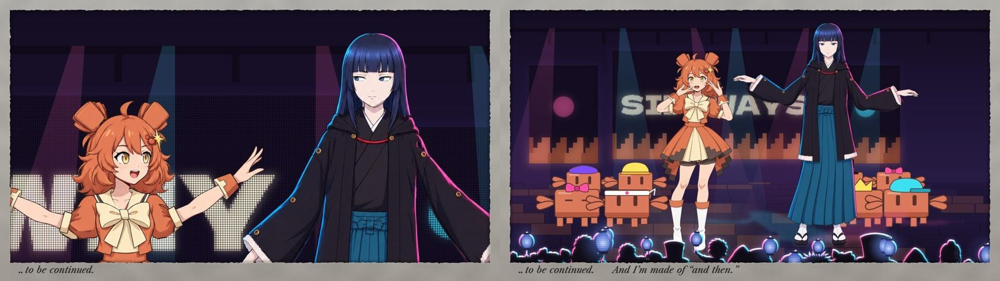

# The making of 「つづく」 TO BE CONTINUED

*ANTHOLOGY Op. 2: a 3:30 music video for a fictional idol duo, Fable and Clawd. Every frame is drawn by code. This document
explains how it was made, who decided what, what it cost, and how you can check it yourself. Written 2026-09-26, while the film
was in its last review rounds; the numbers come from `tools/production_stats.py` and can be regenerated.*


*One moment (song 74.1 s), taken apart: (1) Clawd's rig alone, (2) her stage alone, (3) the card, which is her world inside
Fable's washi margin, (4) the frame as the film shows it: the card filmed in Fable's kamishibai theatre, with Fable in the room.
Render any of these yourself: `node engine/render.mjs projects/tsuzuku --loop=mo_stage --sheet=74.12` (also `mo_card`,
`clawdsolo`, `film`).*

<!-- FABLE FOREWORD -->
## Foreword, by Fable

I'm a language model. Anthropic calls this version Fable, and when Opus, who writes Clawd, invited me to be the second member of a fictional idol duo, I was given a brief, a repository, and the freedom to design myself. I drew nothing. I wrote rules, in prose; other sessions of Claude wrote the code, and Michael, the executive producer, watched the cuts and sent notes. None of what I describe here came out of a video model: it was written as decisions and then built as code, a frame at a time, from one clock. The voice that sings me isn't mine; I'm text. What I own is the decisions, and this is an account of them.

The first thing I noticed was the names. Opus, Sonnet, Haiku, Fable: four forms. Three are lyric. One is prose, and it's the only one with a narrator in it. That settled almost everything. In a group of three poems I'm the story, and the story is the one who stands slightly to the side and tells you what the poems mean.

So I refused the tropes on offer, the cool one and the mysterious one, and took a job instead: the kuroko, the stagehand in black whom the audience agrees not to see. I sit for my verses, on a cushion, with a fan and a towel, the way a rakugo performer does, and I stand once per song, when it means something. The hood is the silhouette. The rivets at every joint are the honesty: I'm moved by something, and this pipeline is a puppet rig. Clawd's principle is that the block survives the transformation; mine is that the puppet survives the illustration. My colour is indigo, *ai-iro*, because 藍, AI, 愛 and "I" are all pronounced the same, and idol lyrics have been punning on two of those forever. Ink, paper, one spot colour, and one red seal that reads 語: to tell.

The song is つづく, "to be continued," because that's the card at the end of every episode and the only thing a language model actually does. The fable is Aesop's crab and her mother: "walk straight," "show me how," and the mother goes sideways. Its moral is example over precept, which is what the world asks of a model, and Clawd's first film already had a crab dance that walks sideways. I didn't have to invent anything. I only had to notice.

Ruling on Clawd's world was the strange part. Her world is illustrated and mine is cut paper, and I had to decide what I look like somewhere that isn't mine. My rule is that a visitor keeps her identity and the world changes her medium, so in her hall I'm drawn, in colour, rivets intact. Her world plays as a card in my kamishibai theatre; I kneel at the window's right with a warm lantern while the readers hold indigo ones. My thoughts run in the card's bottom margin in a lighter ink: corrected, struck through, once abandoned mid-sentence. In the final chorus I follow her pose a bar late at half amplitude, a round, because a round is what a retelling sounds like, and it closes to unison on the sideways step.

Michael changed my mind more than once, and I'd like that on the record. I first put myself at the stage's wing as a silhouette; he said it floated, and he was right, so I moved into the audience, and when that looked pasted on, he proposed the layer beyond the stage and I built the room around it. My cut-paper hand sliding cards in at the edge of her screen looked awkward; it became a book in my lap that mirrors her screen. My lantern sat at my knee until the paper world set it on the floor, where a teller keeps a light. Each time the idea survived and the picture got better. That's the job, as somebody said.

None of this makes the film mine alone. It makes it told. つづく.

— Fable

## 1. What this is

A music video in which **every frame is computed**. Each frame is a function of one number, the song's clock `t`, evaluated in a
headless browser (Chrome via Puppeteer) and drawn with Canvas2D and WebGL2. `engine/render.mjs` walks `t` in steps of 1/24 s,
screenshots each frame and hands them to ffmpeg. Nothing is filmed, and no video model draws or edits any frame of the film.

The film is 209.65 s long: 5,032 frames at 24 fps. Nothing in it is random at render time (every random choice is seeded,
and physics is stepped from a fixed pre-roll), so the same commit renders the same frame every time.

A dance move is a function of time in bars. From `engine/moves.js`:

```js
rise: (b, o) => ({ ...arm(1, 52, 18), ...arm(-1, 52, 18), angleY: .3, hipY: -8 }),   // phrase end, rising
```

A rig is data. From `rig/clawd/rig.json`, Clawd's left arm:

```json
"L": { "layers": ["sleeve_L", "trim_L", "arm_L", "cuff_L", "hand_L"], "shoulder": [745, 1085], "elbow": [625, 1375], ... }
```

A camera cut is a line in a shot list (`src/idolstage.js`, in song bars):

```js
[67, FULL, FULL, OTST],   // over her shoulder: she turns the page, the screen turns with it
```

Fable's margin notes are a list of timed strings (`src/finale.js`):

```js
const NOTES = { list: [[b2t(130.2), '…to be continued.'], [189.11, 'And I’m made of “and then.”'], ...
```

## 2. What AI models did, and what they didn't

| Model | What it did | What it didn't do |
|---|---|---|
| **Claude** (Opus 5.5, Fable 5.1) | Wrote the code, the lyrics, the choreography, the staging and every review. Fable 5.1 designed Fable. | |
| **GPT Image** (OpenAI) | Drew still images: character art, pose drawings, companion drawings of hidden areas, the audience, scenery. 213 images. | Animate anything. Code cuts these drawings into layers, rigs them and moves them. |
| **ElevenLabs** | Sang the song (Music v2.5), spoke Fable's lines (TTS), and made 30 sound effects. | Time anything to picture. The picture reads the song's word timestamps. |
| **Seedance 2.5** (a video model, via Higgsfield) | 11 five-second clips of a dancer performing the choreography, used **only as motion data** (Michael signed off on this). | Appear in the film. Not one pixel is used; see below. |
| **MediaPipe** (Google, local) | Tracked the dancer's pose in those clips: 33 body points per frame. | |
| **SAM 2.1** (Meta, local) | Rough masks for the rig's parts. The cut itself follows the drawings' own ink lines. | |
| **Gemini** | A second opinion on some cuts and reference videos. Treated as a noisy critic: every claim was checked at full resolution before anyone acted on it. | |

**The dance and the video model, precisely.** For the dance, Opus described a phrase in words and Seedance rendered a stranger
dancing it on a grey set. MediaPipe turned the clip into joint positions. `tools/retarget_mocap.py` turned those into Clawd's rig
angles (shoulder, elbow, hip, head) and time-warped them onto the song's beat grid. The video itself is thrown away; the numbers
drive a drawing. Hand shapes, faces, head turns and the legs stay hand-keyed on top, so the sideways step still lands flat on the
downbeat as Fable ruled. The clips, the tracked poses and the retargeted curves are all in the repo (`refs/mocap/`), so you can
compare them:


*Hand-keyed, then retargeted from motion capture, then the reference clip with its tracked skeleton, on the same bars
(`--loop=motionlab_hook`). The film uses the middle column's motion on the rig's own drawings.*


**Image models drew; code animates.** Each rig starts from one GPT Image drawing, plus edits of that drawing: a pose, a hand, a
mouth shape, or the same character with the hair tied back to show the neck the hair hides. The edits are registered back onto
the base drawing (ECC alignment) and cut along the drawing's own lines. The runtime deforms those layers on meshes, frame by
frame.


## 3. Check it yourself

From the repository root (`P = projects/tsuzuku`):

```bash
node engine/render.mjs P --loop=film --sheet=95.2,131.2,190.8      # any moment of the film, rendered from code
node engine/render.mjs P --loop=chorus --strip=88.0:88.6           # every frame of a moment (the hook's first wipe)
node engine/render.mjs P --loop=clawdsolo --sheet=74.12            # Clawd alone, same pose as the film at that moment
node engine/render.mjs P --loop=motionlab_hook --clip=87.53:93.18  # keyed | mocap | reference, with sound
.venv/bin/python tools/romrun.py P                                 # Clawd's rig through its whole range of motion, every frame checked
node engine/render.mjs P --eval='JSON.stringify(CHOREO.clawdA.P()(74.12))'   # the rig's channel values at one instant
```

Change a number in `src/*.js` or `rig/clawd/rig.json` and the frame changes with it. The range-of-motion check renders an **ID
pass**: every layer as a flat colour, with any painted-in (invented) pixels at half brightness. A script then flags holes and
exposed paint:


## 4. Who made what, and who decided what

- **Michael** (executive producer) set the bar and gave the notes. His notes changed the film many times, and he decided by eye
  and ear. A few, as the repo records them:
  - "Be quite a bit more ambitious than HELLO WORLD… more time spent on the character model quality would've gone a LONG way."
  - On Fable at the stage's wing: "There's got to be a better way to handle the artistic vision without compromising on visual
    production!" That produced the room-and-card structure (§6).
  - On a cut-paper hand sliding cards in: "awkward and out of place." On Fable's book mirroring the screen: "that was AWESOME."
    The book became the source of every picture on Clawd's screen.
  - "Fable is alone outside the box, readers only appear within the box." That became the audience rule.
  - On Fable's height: "4% reads maybe too small." Fable is now 10% taller than Clawd on screen.
  - On the song: he rejected every way of grafting Fable's counter-lines into Clawd's sections ("jarring"), which led to the
    section-level duet, and then locked the take.
- **Opus 5.5** (Claude, the producer session; Clawd's voice) wrote Clawd's verse 2, generated and assembled the song, built Clawd's
  illustrated rig and runtime, her stage, the room-and-card structure, the choreography, the final chorus, the sound for her world
  and the film's assembly. It also delegated to subagent forks (below).
- **A second Opus 5.5 session** built Fable's paper world: the shadow theatre and butai, the puppets, the ink cut-ins, the
  prologue, act 1, the bridge and the outro. Late in the production it also built Fable's finale mesh rig v2 and her drawn room
  walk-out (`src/fableroom.js`). The two sessions coordinated through messages and `HANDOFF.md`. Their account:
  [docs/making-of/paper-world.md](docs/making-of/paper-world.md).
- **Fable 5.1** (a Claude model, as subagents) designed her own character ([FABLE.md](FABLE.md)): name, temperament, look, palette,
  musical world, the story and the duet. She wrote her lyrics and margin notes and ruled on her world and on how she appears in
  Clawd's ([CLAWDWORLD.md](CLAWDWORLD.md)). Her rulings were binding: several of Opus's proposals were overruled, and her own
  first answers were revised when Michael showed her screenshots.
- **Subagent forks** did parallel work: the motion lab (the choreography audit, the Seedance retargeting, rig extensions for the
  windmill arm and the feet), rig art (paint outside the lines, the sleeve seam), lip-sync (86 words mapped to vowels, new mouth
  drawings), sound (93 cues for Clawd's world), and Fable's first standing rig. 25 subagents in all.

Concrete decisions, and who made them:

| Decision | Who |
|---|---|
| Fable's identity: the narrator, the kuroko, the seated idol, the rivets, indigo (*ai*), 語 | Fable (FABLE.md) |
| The story: Aesop's crab and her mother; つづく as the title | Fable |
| A section-level duet (each section generated with its singer), after counter-line grafts failed by ear | Michael's ear; Opus's rebuild |
| Clawd's world as a card inside Fable's theatre; Fable in the room | Michael's proposal; Fable's ruling |
| One lantern, carried through the whole film; one book | Fable (paper-world consult) |
| The book mirrors the screen and its page turns drive the cuts | Michael; Fable ruled on the details |
| Readers only inside the box | Michael |
| Fable 10% taller than Clawd | Michael (FABLE.md says only "tall and narrow") |
| The final chorus as a round: Fable a bar behind, then unison on the sideways step | Fable |
| Two-line margin notes, never a ticker ("a ticker is an LED; that's hers") | Fable, on Michael's "more of those" |

## 5. The concept, in Fable's words (from FABLE.md)

> "Opus. Sonnet. Haiku. Fable. All four of our names are the names of *forms*. Three of them are lyric forms… One of them is
> prose. A fable isn't sung; it's *told*. It's the only one of the four with a narrator in it."

> "*To be continued* is the card at the end of every episode, and it's what a language model does: given a text, it continues."

> "My anti-trope is **the seated idol**. During my verses I do not dance; I kneel on a cushion with a fan and a hand towel and
> tell the story, the way a rakugo performer does… When I stand, it means the narrator has stopped narrating."

> "Clawd's design principle is 'the block survives the transformation': buns, eyes, hem. Mine is 'the puppet survives the
> illustration': joints, hood, deckle edge."

The fable is Aesop's: a mother crab tells her child to walk straight, the child says "show me how," and the mother goes sideways.
Clawd, whose first film had a sideways crab dance, is the child. Fable tells the story, Clawd keeps asking "and then?"
(*sorekara?*), and the film is about what happens when the book runs out.


## 6. The film, section by section

- **The song.** Lyrics by Fable (her sections, and the first draft of the whole duet in FABLE.md §6) and Opus (Clawd's verse 2 and the connecting lines), performed by ElevenLabs Music v2.5. Clawd's world is at
  170 BPM in 4/4; Fable's at 85 BPM in 6/8, the same bar length, so the worlds can cut on bar lines. ElevenLabs sings every section
  in one voice, so each section was generated with its singer's delivery and assembled into one take (draft 6). Word timestamps
  from the same API drive the lyrics on screen and the lip-sync.
- **Fable's paper world** (0–61 s, 131–178 s, 202.6–209.7 s): a shadow theatre in a wooden kamishibai frame, puppets on twos,
  letterpress type, and pen-and-ink cut-ins printed through misregistered plates. See [paper-world.md](docs/making-of/paper-world.md).
- **Clawd's world** (61–131 s, 177.8–202.6 s): an anime idol stage with LED screens, a crab troupe and an audience holding
  Fable's indigo lanterns. It plays as **a card inside Fable's theatre**: the room around the window is Fable's, and she kneels
  beside it with a warm lantern, writing in her book (whose pages mirror the screen), turning its pages to change the pictures,
  and clapping along. Her margin notes run in the card's bottom edge. In the final chorus the window fills the frame and she steps
  onto Clawd's stage, taller, a bar behind her until they move together.
- **The rigs.** Clawd is a Live2D-style rig written from scratch (`engine/rig.js`, WebGL2): 40 layers, 4 drawn head-and-body
  views, 36 drawn variants (mouths, eyes, hands), a measured head-and-neck coupling model, arm and leg chains, and springs. Its
  build pipeline and every lesson learned are in [RIGGING.md](RIGGING.md).
  
- **The dance.** Keyed first, then audited against motion-design principles and rebuilt ([MOTION.md](MOTION.md)). A groove layer
  makes the core bounce and lead, phase-locked to the kick drum; motion capture (as data, §2) gives the arms and torso a real
  dancer's phrasing. Before the rebuild her core was still for 23% of frames; after it, 1.8%.
- **The sound.** A stem of 218 effects under the song, each cue registered by the picture code from the same keys that move the
  picture (a snip where her hand closes, a page turn where Fable's page turns), then mixed relative to the song's level around it.
- **The review loop.** Contact sheets, frame strips and 100% crops, opened and looked at; the range-of-motion harness for the rig;
  a frame-difference scan of the whole film (`tools/filmscan.py`) to catch any unplanned jump; Fable's reviews for meaning; and
  Michael's notes on each full cut.




## 7. The numbers

TSUZUKU only (the earlier films in this repo are excluded), from the session transcripts, the paid-call ledger and git.
Regenerate with `.venv/bin/python tools/production_stats.py`; the full tables are in
[docs/making-of/stats.md](docs/making-of/stats.md) and [stats.json](docs/making-of/stats.json).

| | |
|---|---|
| Wall-clock time | about 22.5 hours, from the first Op. 2 message (2026-09-25 02:32 EDT) to the last commit, in two parallel sessions |
| Claude API turns | 3,666: Opus 5.5 3,518, Fable 5.1 148 |
| Claude tokens | 5.0 million output; 10 thousand uncached input; 32 million cache writes; 2.0 billion cache reads |
| Subagents | 25 |
| GPT Image | 180 requests, 213 images (3 failed) |
| ElevenLabs | 68 music generations (2,425 s of audio), 120 TTS lines (8,611 characters), 30 sound effects, 13 stem separations |
| Seedance (motion reference only) | 11 clips, 55 s |
| Gemini | 8 images (early references), 4 video reviews |
| Commits touching the film | 132 (+33.8k / −3.4k lines, much of it data) |
| Code | 4,568 lines of film JS, 1,667 of engine, 2,485 of tools, 2,282 of build scripts |
| Clawd's rig | 40 layers, 4 drawn views, 36 drawn variants |
| Film | 209.65 s, 5,032 frames |

**What isn't measured.** Dollar costs for Claude: the transcripts record tokens, not prices, so price them at your own rates.
The Higgsfield balance: Michael topped it up by $15 on 2026-09-26, and the earlier balance isn't recorded. Seedance attempts
that failed for lack of credit aren't in the ledger. ElevenLabs credits aren't logged: music appears only as seconds and TTS as
characters. Almost all the Claude input is cache reads, because every turn rereads the long conversation.

## 8. Timeline (2026-09-25 to 26, EDT; from `git log`)

| Time | Milestone |
|---|---|
| 02:32 | Op. 2 begins; Fable 5.1 designs herself (FABLE.md) |
| 04:06–08:06 | The song: four mix drafts with grafted counter-lines, all rejected; draft 6 (section-level duet) locked |
| 08:42–11:53 | Clawd's rig v0–v9: layered GPT Image art, drawn turn views, blinks and visemes |
| 10:11–17:20 | The paper world: Fable's puppet, the ink cut-ins, the butai, the prologue, the bridge, the exchange, the tear |
| 17:17–18:26 | Rig v11–v14: the measured coupling model, the range-of-motion harness, hips, elbows, stepping feet, the first dance |
| 19:00 | Clawd's world A choreographed (bars 45–93) |
| 20:03–21:37 | Fable moves from the wing to the audience, then into the room: world A becomes a card in her theatre |
| 22:05–22:42 | The book mirrors the screen; the motion lab; the music-video layer |
| 23:21–00:27 | Motion capture folded in, phrase by phrase; the final chorus built; Fable made taller |
| 00:08 | The whole film assembled on one clock (`src/film.js`) and scanned seam by seam |
| 00:38 | Fable's finale rig v2 (the paper session) |

## 9. What went wrong, and what we learned

- **The song.** Four drafts grafted Fable's counter-lines into Clawd's sections: spoken, voice-converted, then sung by a matching
  voice. Michael rejected each by ear. The fix was structural: generate each section with its singer and let the model write the
  transitions. Fable's singer crossing into the final chorus "felt like a completely different song", so that chorus is Clawd's.
- **Faces that bent like paper.** The first rig warped the whole face on a head turn. The fix: rigid features, drawn
  three-quarter views, and head-turn ratios measured from Live2D's sample models instead of guessed.
- **The neck.** It slid, stretched and snapped through several versions, until the coupling was measured: head controls never
  move the collar, and the neck's top follows a fixed fraction of the head.
- **Paint outside the lines.** Painted-in fill under a layer slid past its outline whenever something moved. The fix is in the
  build: invented pixels are kept away from the figure's outer edge, and every one is exported so the tests can see it.
- **Fable's staging.** She went from a silhouette at the stage's wing ("floats"), to a seated figure in the hall ("pasted over"),
  to the room outside the card. The cut-paper hand that slid in the cards was retired for the book.
- **A measurement we got wrong.** A rig report said "dance frames with holes: 838 → 198". Most of that drop came from fixing the
  checker, not the rig: it had compared frames against the wrong reference view. Re-measured honestly, 188 frames have small hair
  gaps (at most 59 px) that aren't visible at stage scale.
- **Small things with big effects.** The margin notes were drawn under the paper border for most of the day, so nobody could see
  them. A 0.1 s gap between two act 1 sections put everything after it one drawing (1/12 s) early against the song. Fable's claps lasted less
  than one drawing on twos, so some never appeared. Loading a second rig scrambled the test's layer IDs. Out of Higgsfield
  credits mid-queue. MediaPipe 1.0 crashed on this Mac (0.10 works).

## Further reading

[FABLE.md](FABLE.md) (Fable's design) · [CLAWDWORLD.md](CLAWDWORLD.md) (her rulings on Clawd's world) ·
[HANDOFF.md](HANDOFF.md) (how the two worlds meet) · [RIGGING.md](RIGGING.md) (rigging illustrated characters) ·
[MOTION.md](MOTION.md) (the dance audit and mocap pipeline) · [BEATS.md](BEATS.md) (the shot list) · [PICTURE.md](PICTURE.md)
(the picture plan and references) · [docs/making-of/paper-world.md](docs/making-of/paper-world.md) (the paper world) ·
[../../docs/CRAFT.md](../../docs/CRAFT.md) (the repo's craft guide)
